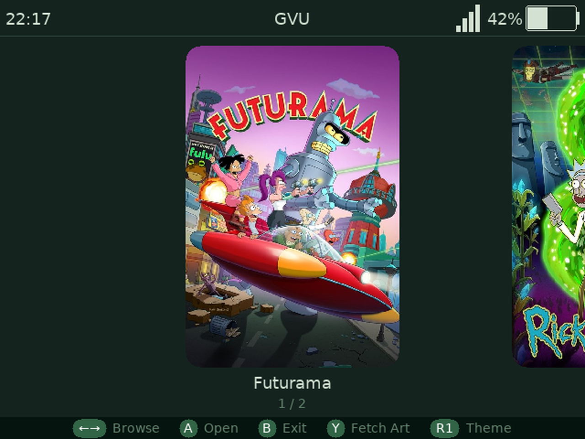

<div align="center">
  
  <h1>GVU</h1>
  <p>Video player for SpruceOS handheld devices</p>
</div>

---



GVU is a native video player for SpruceOS devices. It has a three-level media browser (shows → seasons → files), automatic cover art fetching, watch history with resume, .srt subtitle support with on-device subtitle download, and a clean fullscreen playback UI with OSD. It's written in C around FFmpeg and SDL2.

---

## Supported Devices

| Device | Notes |
|---|---|
| Miyoo A30 | 640×480, ARMv7. Works great. |
| TrimUI Brick / Hammer | 1024×768, AArch64. Works great. |
| Miyoo Flip V1/V2 | 640×480, AArch64. Works great. |
| Miyoo Mini Flip (V4) | 752×560, ARMv7. Audio via SigmaStar bridge. |
| Miyoo Mini V2/V3 | 640×480, ARMv7. Video works; audio broken on some firmware. |

---

## Installation

1. Download the latest release zip from the [Releases](../../releases) page.
2. Extract the zip to your SD card — make sure you have a `/mnt/SDCARD/App/GVU/`.
3. Launch from the SpruceOS app menu.

On first launch, GVU scans your media folders and builds its library. Make sure your video files are in `/mnt/SDCARD/Roms/MEDIA` or `/mnt/SDCARD/Media/` (or any subfolder) organized by show name.

> EXAMPLE: /mnt/SDCARD/Roms/MEDIA/Futurama/Season 1/S01E01 Space Pilot 3000.mp4
> EXAMPLE: /mnt/SDCARD/Media/Movies/Back to the Future (1985)/Back to the Future.mkv

---

## Features

- **File browser** — three-level hierarchy (shows → seasons → files) with folder grid and cover art
- **Cover art** — automatic fetch from TMDB and TVMaze (press Y on any show)
- **Playback** — fullscreen, hardware-scaled, software-decoded H.264/H.265/VP9/MP4/MKV/AVI
- **Seek** — frame-accurate, ±10s / ±60s by default
- **Watch history** — remembers where you left off across all shows
- **Subtitles** — load local .srt files or search and download from SubDL / Podnapisi
- **Themes** — ten color themes, cycle with R1 in the browser
- **OSD** — progress bar, current time, title, volume
- **Volume sync** — reads and mirrors the device hardware volume at startup
- **Status bar** — clock, title, WiFi signal, battery level

---

## Basic Usage

### Navigation

- **D-pad** — navigate the file browser
- **A** — open folder / play file
- **B** — back
- **Hold D-pad up/down** — fast scroll through long lists

### Playback controls

| Button | Action |
|---|---|
| D-pad left/right | Seek ±10 seconds |
| D-pad up/down | Brightness ± |
| L1 | Seek -60 seconds |
| R1 | Seek +60 seconds |
| L2 | Previous file in folder/season |
| R2 | Next file in folder/season |
| A | Play / Pause |
| B | Back to browser |
| X | Cycle audio track |
| Y | Zoom cycle |
| SELECT | Toggle mute |
| START | Toggle subtitle / open subtitle downloader |
| START + D-pad left/right | Subtitle sync ±0.5s |
| START + D-pad up | Change subtitle speed to match with NTSC/PAL, etc.|
| START + D-pad down | Reset subtitle speed/sync |
| Volume up/down | Adjust volume |

### Browser controls

| Button | Action |
|---|---|
| D-pad | Navigate |
| A | Open folder / play file |
| B | Back (press twice at top level to exit) |
| X | Open watch history |
| Y | Scrape cover art for selected show |
| SELECT | Cycle view layout |
| R1 | Cycle color theme |

### Cover art

Press **Y** on any show in the browser folder grid to scrape cover art from TMDB and TVMaze. A TMDB API key (free) improves results — enter yours in `/mnt/SDCARD/App/GVU/resources/API/`. TVMaze requires no API/key.

You can also add covers manually by placing a `cover.jpg` or `cover.png` in the folder.

### Subtitles

Local .srt files are loaded automatically if they share a filename with the video. To download subtitles during playback, press **START** — if no subtitle is loaded it opens the downloader. Use **START + D-pad left/right** to adjust subtitle timing.

You can add subtitles manually with a computer, just make sure the .srt file matches the video file name in the same folder.
> EXAMPLE: S01E01.mp4, S01E01.srt
---

## Configuration

Settings are stored in `gvu.conf` in the app folder. Most options are accessible from the in-app settings menu. Common things you might want to set:

```
tmdb_key = your_tmdb_api_key_here
subdl_key = your_subdl_api_key_here
theme = spruce
```

TMDB keys are free at [themoviedb.org/settings/api](https://www.themoviedb.org/settings/api).
SubDL keys are free at [subdl.com](https://subdl.com).

---

## Supported Formats

Video: H.264, H.265/HEVC, MPEG-4, VP8, VP9
Audio: AAC, MP3, AC3, Opus, Vorbis, FLAC
Containers: MP4, MKV, AVI, WebM, MOV

All decoding is software. H.264 at 480p runs smoothly on all devices. H.265 works on faster hardware (Brick, Flip); A30 handles it at 480p.

---

## Developer Notes

See [gvu-handoff.md](gvu-handoff.md) for full build instructions, device-specific quirks, architecture notes, and SpruceOS integration details.
